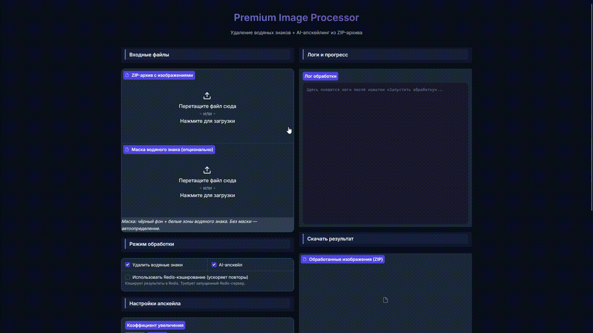

# 🖼️ Premium AI Image Processor

A high-performance, professional-grade tool for batch image processing. This application combines state-of-the-art **AI Upscaling** (Real-ESRGAN/EDSR) with intelligent **Watermark Removal** to transform your assets into high-quality, clean images ready for production.

---

## 📽️ Application Demo

*(Above is a demonstration of the batch processing workflow and AI upscaling capabilities.)*

---

## ✨ Key Features
- 🚀 **Batch Processing**: Process entire ZIP archives of images in seconds.
- 💎 **AI Upscaling**: Choice of **Real-ESRGAN** (best quality, restored textures) or **EDSR** (optimized speed).
- 💧 **Watermark Removal**: Advanced inpainting methods to clear unwanted logos and watermarks.
- 🎨 **Hybrid Interaction**: Modern **Gradio Web Interface** for ease of use + powerful **CLI** for automation.
- ⚡ **GPU Acceleration**: Full CUDA support for 10x faster processing on compatible hardware.
- 🛠️ **Smart Fallbacks**: Automatically degrades to optimized CPU algorithms if specialized AI libraries are missing.

---

## 🛠️ Technology Stack
- **Language**: Python 3.10+
- **Frontend**: Gradio (Web UI)
- **Computer Vision**: OpenCV, Pillow, NumPy
- **Deep Learning**: PyTorch (Real-ESRGAN), BasicsR
- **Optimization**: Multi-threading for efficient I/O and GPU utilization.

---

## 📥 Installation

### 1. Environment Setup
```bash
# Clone the repository and enter the directory
python -m venv venv
# Activate on Windows:
venv\Scripts\activate
# Activate on Linux/macOS:
source venv/bin/activate
```

### 2. Install Dependencies
```bash
pip install -r requirements.txt
```

### 3. AI Model Setup (Recommended)
For the highest quality results, install the Real-ESRGAN package:
```bash
pip install torch torchvision --index-url https://download.pytorch.org/whl/cu118  # For NVIDIA GPU
pip install basicsr realesrgan facexlib gfpgan
```
*Note: The application will automatically download the necessary model weights (`.pth` files) into the `models/` folder during the first run.*

---

## 🚀 Usage

### Option A: Web Interface (Recommended)
Launch the interactive web portal:
```bash
python app.py
```
Then open `http://localhost:7860` in your browser.

### Option B: Command Line (For Power Users)
```bash
# Basic usage: Auto-detect watermarks + 4x upscale
python image_processor.py images.zip

# Advanced: custom mask + 2x upscale + JPEG output
python image_processor.py assets.zip --mask water_mask.png --scale 2 --format jpg
```

---

## ⚙️ Advanced Configuration (CLI)

| Parameter | Default | Description |
|-----------|---------|-------------|
| `--output` | `./output_processed` | Output directory for results |
| `--mask` | `None` | Path to a custom binary mask for watermark removal |
| `--scale` | `4` | Upscale factor (`2` or `4`) |
| `--format` | `png` | Output format (`png` or `jpg`) |
| `--no-gpu` | `false` | Force CPU processing |
| `--skip-upscale`| `false` | Run watermark removal only |

---

## 📂 Project Structure
- `app.py`: Graduate Web Application entry point.
- `image_processor.py`: Core AI processing pipeline and logic.
- `models/`: Weights storage for AI models.
- `processed_results/`: Default output directory for completed tasks.
- `requirements.txt`: Project dependencies list.

---

## 🤝 Acknowledgements
- **Real-ESRGAN** by Tencent ARC Lab.
- **OpenCV** for inpainting and image processing primitives.
- **Gradio** for the intuitive interface framework.
